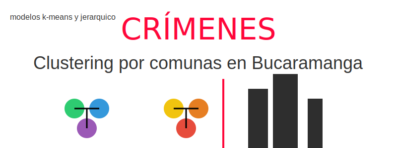

# Aplicación crimenes por comuna en Bucaramanga

  

  
  

## 🔥 Demo

Visita la App en [our website](https://appclustercrimes-hps7f8ushwdyf2bvx9b6k8.streamlit.app/)

## 📚 Documentación

Visita nuestra documentación [here](https://google.com)

## 📑 Tabla de contenido

- [Introducción](#introduccion)
- [Estructura de carpetas](#estructura-de-carpetas)

---

## Introducción

En **Clustering por Comunas en Bucaramanga** se utiliza la inteligencia de dos modelos de clustering (k-means y jerárquico) para agrupar datos de crímenes reportados en la ciudad. La aplicación se centra en:
- Analizar datos de incidentes delictivos.
- Visualizar clusters en un mapa interactivo.
- Ofrecer información relevante para autoridades y ciudadanos.
- Asistencia con LLM para insights

Esta herramienta ayuda a identificar patrones delictivos, permitiendo focalizar estrategias de prevención y optimización de recursos en las comunas con mayor incidencia.

---

## Estructura de carpetas

La arquitectura del proyecto se compone de los siguientes módulos:

- **EDA:** Recopilación y preprocesamiento de datos de Datos Abiertos Colombia.
- **models:** Preparación de datos para modelos de machine learning supervisado (k-means y jerárquico).
- **notebook:** Resumen de limpieza de datos.
- **LLM:** Consumo de API de modelos de lenguaje para generar insights a partir de los resultados del clustering.
- **utils:** Carga de `config.yaml`.
---
